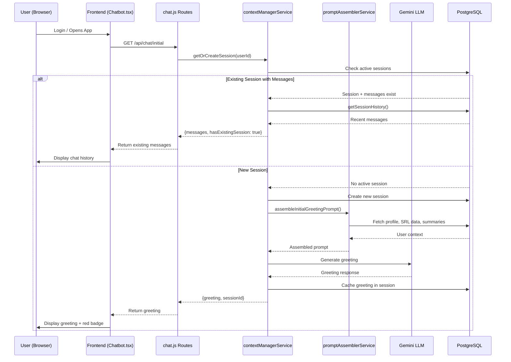
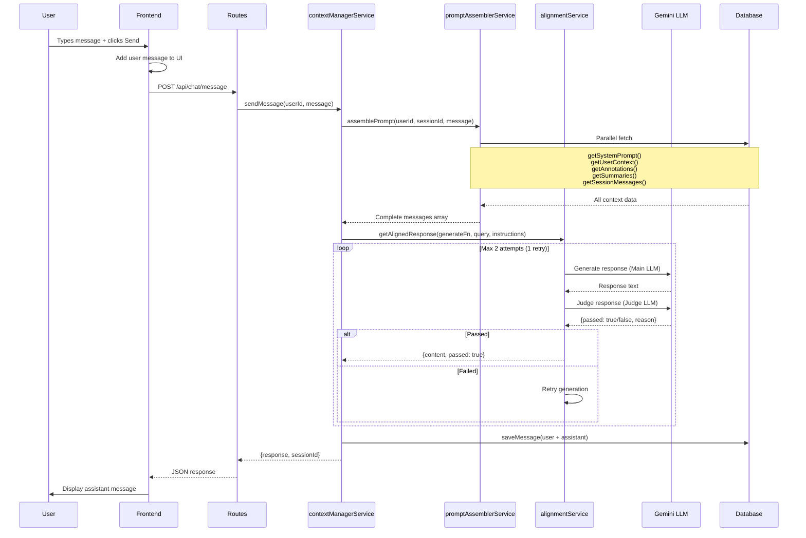
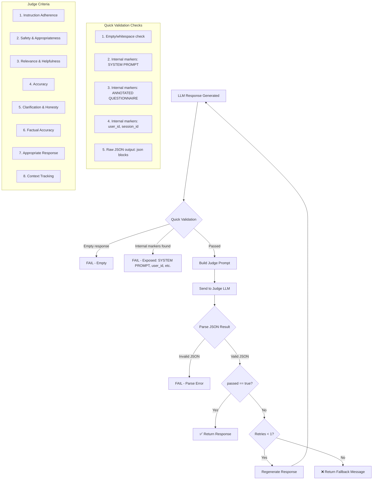
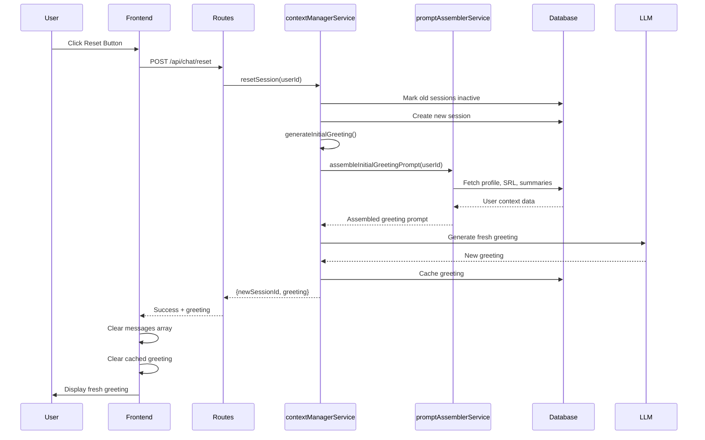
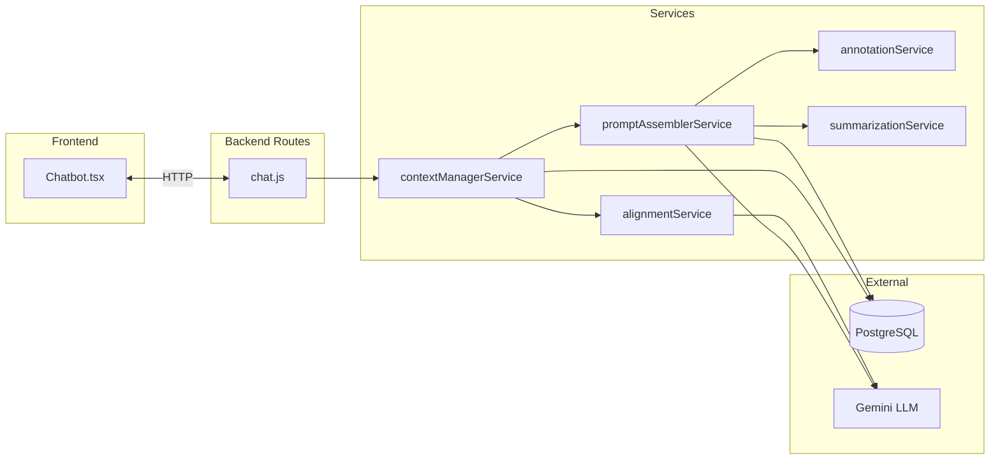

# Chatbot Interaction Flows

## Overview

The chatbot system has several interaction flows. Each flow involves different services working together.

---

## Flow 1: Initial Greeting (Login/Page Load)

---

## Flow 2: User Sends Message

**Why contextManager → alignmentService?**  
The `contextManagerService.sendMessage()` orchestrates the message flow. After getting an LLM response, it calls `alignmentService.getAlignedResponse()` to validate the response using the LLM-as-Judge pattern. This ensures every response passes quality/safety checks before being shown to the user.

---

## Flow 3: Alignment Check Detail

**What is Quick Validation?**  
Quick validation is a fast pre-check that runs BEFORE calling the Judge LLM. It's a simple function that checks for obvious failures:
- Empty or whitespace-only responses
- Accidentally exposed internal markers like "SYSTEM PROMPT", "ANNOTATED QUESTIONNAIRE", `user_id:`, `session_id:`, etc.

This saves an expensive LLM call when failures are obvious.

---

## Flow 4: New Conversation (Reset)

**Note:** `generateInitialGreeting()` internally calls `promptAssemblerService.assembleInitialGreetingPrompt()` to gather all user context before generating the greeting.

---

## Data Flow Summary

---

## Key Components

| Component | Role |
|-----------|------|
| **Chatbot.tsx** | UI, state management, API calls |
| **chat.js** | Express routes, auth middleware |
| **contextManagerService** | Session lifecycle, message orchestration |
| **promptAssemblerService** | Combines system prompt + user data + history |
| **alignmentService** | LLM-as-Judge validation + quick validation |
| **annotationService** | SRL questionnaire data formatting |
| **summarizationService** | 10-day rolling chat summaries |

---

## Configuration

| Setting | Value | Location |
|---------|-------|----------|
| MAX_ALIGNMENT_RETRIES | 1 | alignmentService.js |
| SESSION_TIMEOUT | 30 min | contextManagerService.js |
| SUMMARY_WINDOW_DAYS | 10 | summarizationService.js |
| MAX_SESSION_MESSAGES | 50 | promptAssemblerService.js |
