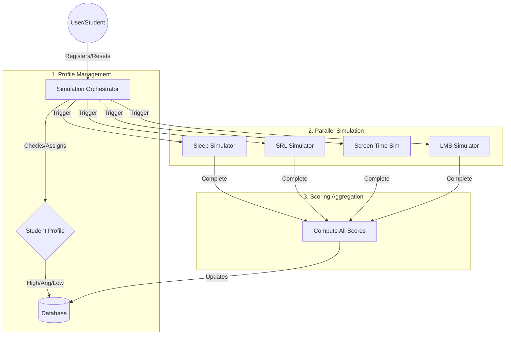
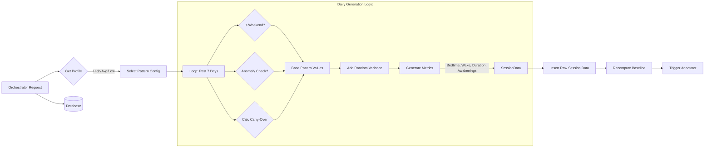
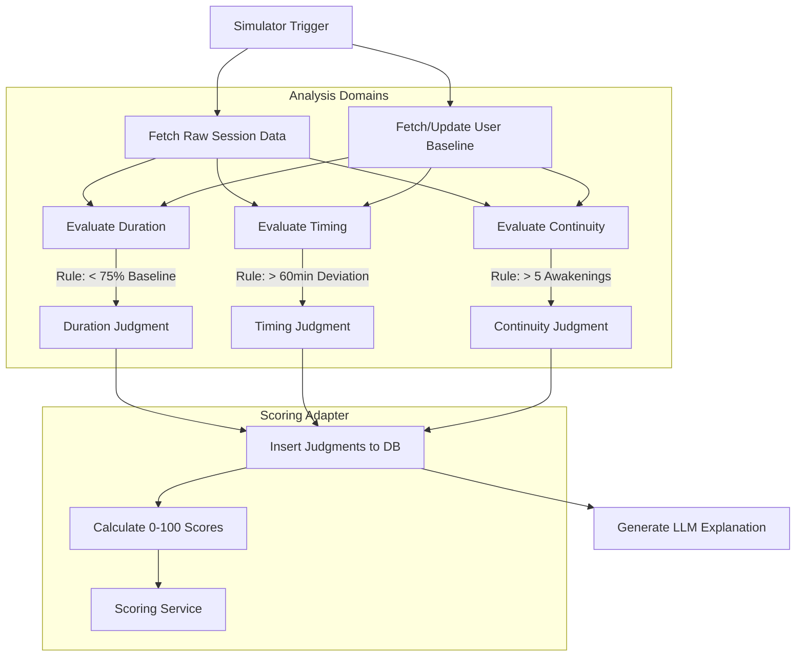
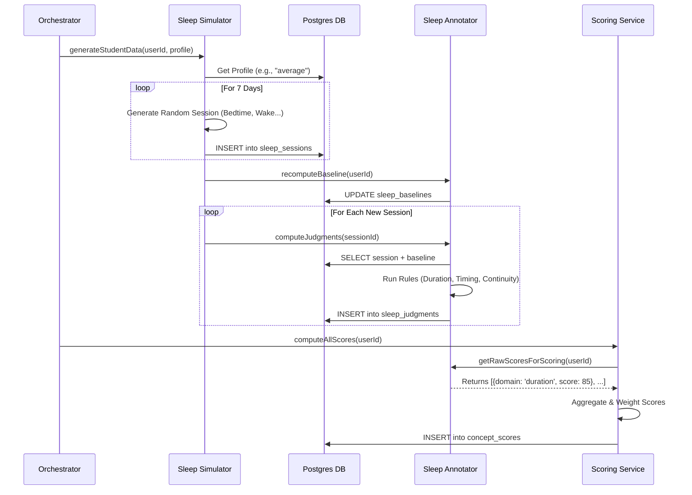

# Simulation System Architecture

This document details the architecture of the Simulation System, explaining how the **Simulation Orchestrator**, **Simulators**, and **Annotators** interact to generate student profiles, simulate realistic data, and produce judgments.

## 1. High-Level Orchestration Flow

The **Simulation Orchestrator** (`simulationOrchestratorService.js`) is the central coordinator. It is responsible for assigning a consistent student profile (High, Average, or Low Achiever) and triggering parallel data generation for all domains.

## 2. Simulator Logic (Example: Sleep Simulator)

Each simulator (e.g., `sleepDataSimulator.js`) generates realistic time-series data based on the student's assigned profile. It uses statistical models with variance, anomalies, and correlations.

### Key Concepts:
- **Profile-Based Patterns**: Different baseline values for High, Average, and Low achievers.
- **Modifiers**:
    - **Weekend Effect**: Shifts bedtimes/wake times on weekends.
    - **Anomaly Nights**: Random "bad" nights for good sleepers, or "good" nights for poor sleepers.
    - **Carry-Over**: A bad night influences the next night's parameters.
- **Triggers**: The simulator **explicitly calls** the annotator service after generating data.

## 3. Annotator & Judgment Logic (Example: Sleep Annotator)

The Annotator (e.g., `sleepAnnotationService.js`) analyzes the raw data against the student's personal baseline to generate human-readable judgments and scores.

### Key Concepts:
- **Baselines**: Dynamic value (e.g., "User usually sleeps 7 hours"). Judgments are relative to *this user*, not just global averages.
- **Rule-Based Judgments**: Deterministic logic (if X < 0.9 * Y then "Warning").
- **LLM Explanation**: Pre-generated text strings explaining the judgment, ready for the chatbot to use.

## 4. Full End-to-End Data Flow

How a specific data point travels from generation to the final score/judgment used by the Chatbot.

